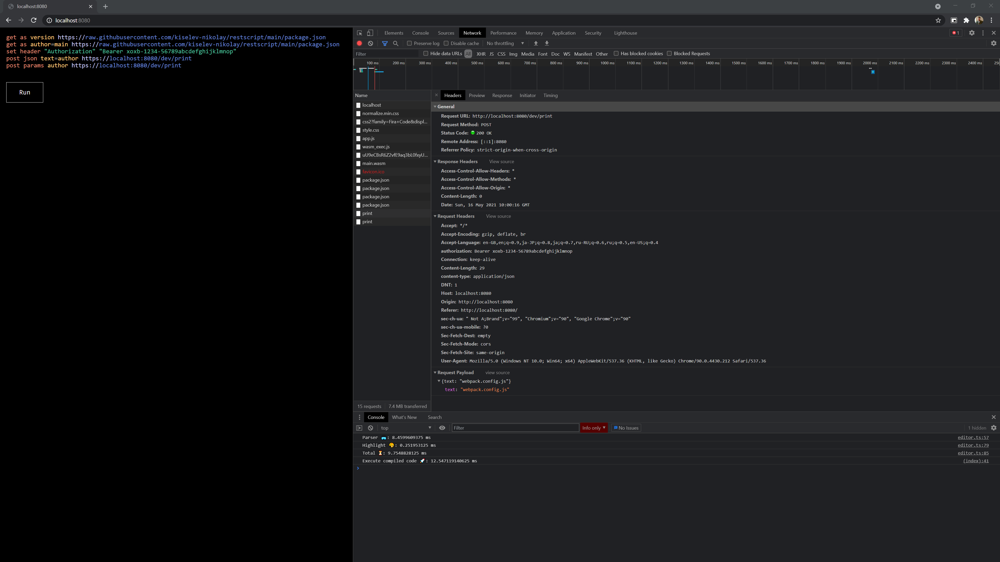

# Execute function

This [RESTscript](https://github.com/kiselev-nikolay/restscript) implementation with a Go executor in WASM.

Live in-browser: [https://kiselev-nikolay.github.io/execute-functions/](https://kiselev-nikolay.github.io/execute-functions/)

## In-Browser example:

```
Parser:                6.541015625 ms
Highlight:             0.177734375 ms
Execute compiled code: 6.0556640625 ms
```


